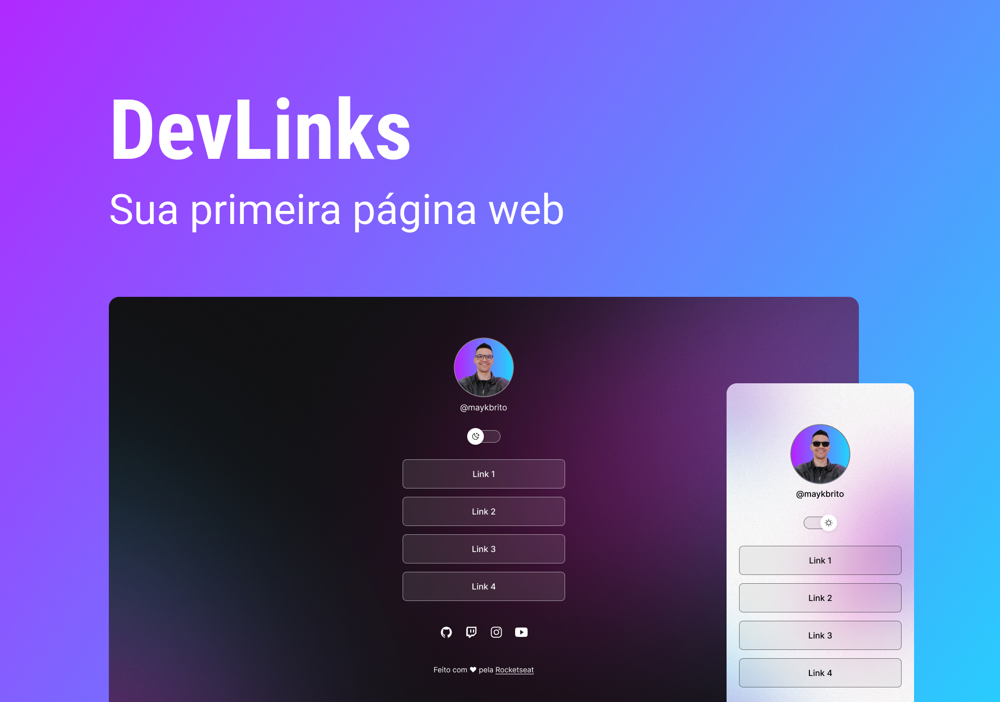

<h1 align="center"> DevLinks </h1>

 
Programa exclusivo  e gratuito, promovido pela Rocketseat para ensino de tecnologias Web.

  <a href="#-tecnologias">Tecnologias</a>&nbsp;&nbsp;&nbsp; | &nbsp;&nbsp;&nbsp;
  <a href="#-layout">Layout</a>&nbsp;&nbsp;&nbsp; | &nbsp;&nbsp;&nbsp;
  <a href="#memo-licença">Licença</a>

  

## 🔋 Tecnologias

Esse projeto foi desenvolvido com as seguintes tecnologias:

-HTML E CSS
-JavaScript
-Git e Github
-Figma

## 💻 Projeto

O DevLinks é um agregador de links para usar como cartão de visitas online.

## 🎈 Layout

Você pode acessar o layout do projeto através [DESSE LINK](<https://www.figma.com/file/YJxPgNBssedhvexzvT2PM7/DevLinks-(Community)?type=design&node-id=0-1&t=Qu0deoJ9SrJpRFJA-0>). É preciso ter uma conta no [Figma](https://figma.com) para acessá-lo.

## :memo: Licença

Esse projeto está sob a Licença MIT. 

--

Feito com ♥ by [Rocektseat](https://www.rocketseat.com.br/?utm_source=google&utm_medium=cpc&utm_campaign=lead&utm_term=perpetuo&utm_content=institucional-lead-home-texto-lead-brandkws-none-none-institucional-none-none-br-google&gclid=CjwKCAjwpayjBhAnEiwA-7ena_MDnK876baJMoTRFOuSzgfQiDbJfvmi1OnnW3Pk2I5_zZKiXOnOaxoC6MUQAvD_BwE) :wave: [Participe da nossa comunidade!](https://discord.gg/rocketseat) 🐱‍🏍
